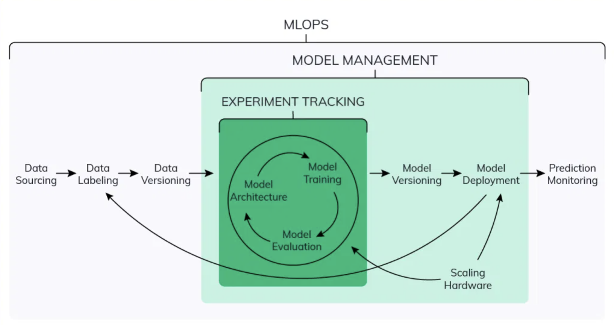
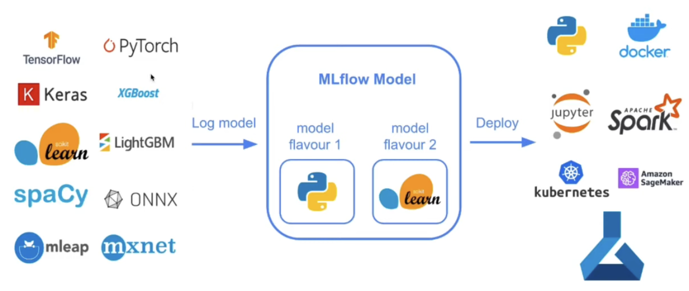
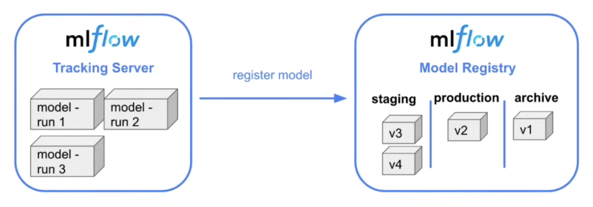

# Week 2 - Experiment tracking

Start MLflow:
```
mlflow ui --backend-store-uri sqlite:///mlflow.db
```

Save parameters manually:
```python
with mlflow.start_run():
    mlflow.set_tag("model", "xgboost")
    mlflow.set_tag("developer", "<your_name>")
    mlflow.log_params(params)
```

Save parameters automatically:
```python
mlflow.xgboost.autolog()
```

Save the model as an artifact:
```python
with open('models/lin_reg.bin', 'wb') as f_out:
    pickle.dump((dv, lr), f_out)
mlflow.log_artifact("models/preprocessor.b", artifact_path="preprocessor")
```

Save the model automatically using `log_model`:
```python
mlflow.xgboost.log_model(booster, artifact_path="models_mlflow")
```

Make predictions with saved model on a Pandas dataframe:
```python
logged_model = 'runs:/a00f1a2f55fd489db2470a187315099f/models_mlflow'

# Load model as a PyFuncModel.
loaded_model = mlflow.pyfunc.load_model(logged_model)

# Predict on a Pandas DataFrame.
import pandas as pd
loaded_model.predict(pd.DataFrame(data))
```

Load model as an XGBoost model;
```python
xgboost_model = mlflow.xgboost.load_model(logged_model)
xgboost_model.predict(valid)
```

## Hyperparameter tuning in MLflow

* Used `Hyperopt` for hyperparameter tuning
* Can use `tags.model = 'xgboost'` to filter out experiment and compare results


## Model management

Model management covers experiment tracking, model versioning and model deployment.


## MLflow model format



## Model registry

Model registry only lists what models are ready for production. CI/CD is needed for actualy deployment.

* An MLflow Tracking Server creates and manages experiments and runs.
* An MLflow Registry Server creates and manages registered models and model versions.




When choosing the optimal model, we need to pay attention to metric, model training time and model size.

```python
from mlflow.tracking import MLflowClient

MLFLOW_TRACKING_URI = "sqlite:///mlflow.db"
client = MLflowClient(tracking_uri=MLFLOW_TRACKING_URI)

# List experiments
client.list_experiments()

# Create new experiment
client.create_experiment(name="my-cool-experiment")

# Find out best runs
from mlflow.entities import ViewType
runs = client.search_runs(
    experiment_ids='1',
    filter_string="metrics.rmse < 6.8",
    run_view_type=ViewType.ACTIVE_ONLY,
    max_results=5,
    order_by=["metrics.rmse ASC"]
)

for run in runs:
	print(f"run id: {run.info.run_id}, rmse: {run.data.metrics['rmse']:.4f}")

# Move model to registry
import mlflow

mlflow.set_tracking_uri(MLFLOW_TRACKING_URI)

run_id = "a00f1a2f55fd489db2470a187315099f"
model_uri = f"runs:/{run_id}/model"
mlflow.register_model(model_uri=model_uri, name="nyc-taxi-regressor")

# Trasition a model from one stage to another
client.list_registered_models()

model_name = "nyc-taxi-regressor"
client.get_latest_versions(name=model_name)
for version in latest_versions:
	print(f"version: {version.version}, stage: {version.current_stage}")

client.trasition_model_version_stage(
    name=model_name,
    version=4,
    stage='Staging',
    archive_existing_versions=False
)

# Another way to transition a model
model_version = 4
new_stage = "Staging"

from datetime import datetime

date = datetime.today().date()

client.update_model_version(
	name=model_name,
	version=new_stage,
	description=f"The model version {model_version} was transitioned to {new_stage} on {date}")
```


