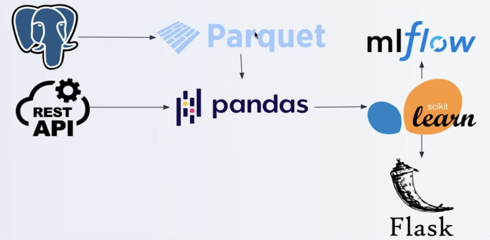

# Workflow orchestration



A set of tools to schedule and monitor on the work that you want to run - to make sure when failure happens, you know where to debug.

Also to avoid model drifting, MLflow can be used to retrain models constantly and compare with previous performance.

## Negative engineering

90% of engineering time spent

* Retires when APIs go down
* Malformed data
* Notifications
* Observability into failure
* Conditional failure logic
* Timeouts

## Introduction to Prefect 2.0

Prefect Core is 1.0 and Prefect Orion is 2.0.

Prefect offers dynamic, DAG-free workflows. DAG-based workflow engines require that all potential task execution paths be explicitly registered before the workflow can run, but with Orion, task execution paths mat not be known prior to a run - the graph "unfolds" as execution proceeds.

## Run MLflow on AWS

When running the MLflow UI on EC2, make sure to add host in the command as well. And when it's running, also make sure to forward port 5000 from VSCode and open this address: http://0.0.0.0:5000
```
mlflow ui --backend-store-uri sqlite:///mlflow.db --host 0.0.0.0
```

## First Prefect flow and basics

You can decorate functions as `@task` and `@flow` with Prefect. If there are returned values with `@task`, we need to add `.result()` to get the values. For `@flow`, if tasks do not depend on each other, we can have them run concurrently by adding `task_runner=ConcurrentTaskRunner()` to execute them faster however if they have to follow a certain order, we need to add `task_runner=equentialTaskRunner()`

To launch Prefect Orion, we can run the following command:
```
prefect orion start
```

## Remote Prefect Orion deployment

Instructions:

1. Create a VM on Cloud Provider of Choice

2. Open port 4200 ingress for TCP and UDP on the VM from 0.0.0.0/0 (all traffic) as well as HTTP in.

3. pip install prefect 2.0

4. Set the UI_API_URL with≤:
```
prefect config set PREFECT_ORION_UI_API_URL="http://<external-ip>:4200/api"
```
5. Start Orion with:
```
prefect orion start --host 0.0.0.0
```
6. From local machine, configure to hit the API with:
```
prefect config set PREFECT_API_URL="http://<external-ip>:4200/api"
```
7. The remote UI will be visible on :4200/

At anytime, we can use the following command to check Prefect config and unset it:
```
prefect config view
prefect config unset PREFECT_API_URL
```

## Deployment of Prefect flow

Configuration:
```
 prefect storage create
# Choose local storage for demo purpose
# location - /Users/tongqiao/.prefect
# name - local
```

Deployment:
```
prefect deployment create prefect_deploy.py 
```

After creating a work queue in Prefect UI, we can see all scheduled runs by typing:
```
prefect work-queue preview <work-queue-id>
```

In order to start scheduled runs, we need to use the agent:
```
prefect agent start <work-queue-id>
```

## Tips

Clear prefect storage:
```
prefect orion database reset
```

