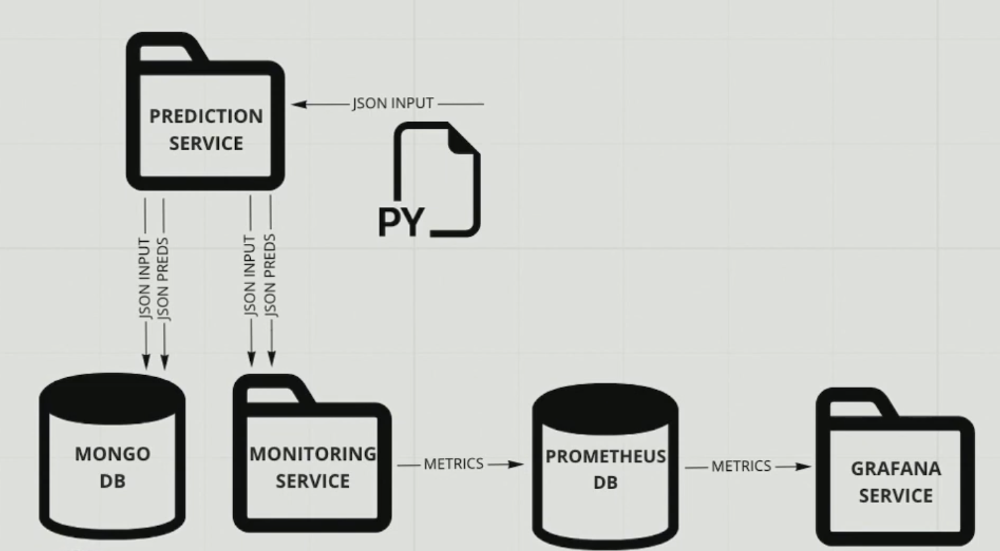
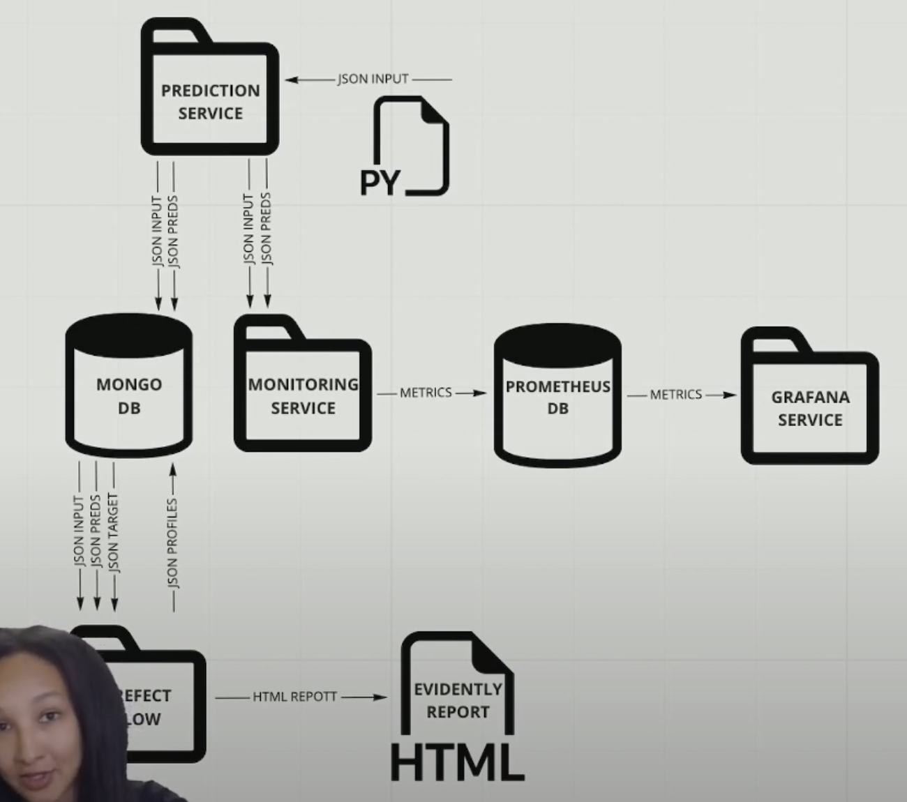

# What shall we monitor?

## 4 major areas

* Service health
* Model performance
* Data quality and integrity
* Data and concept drift

## More things to look at

* Performance by segment (different user groups)
* Model bias/fairness
* Outliers
* Explainability

# How shall we monitor?

## Batch

* Add ML metrics to service health monitoring (realtime monitoring such as Prometheus/Grafana)
* Build an ML-focused dashboard(s) (such as MongoDB/Grafana or BI tools Tableau, Looker)

### ML service + usage simulation + logging + online monitoring

### ML service + usage simulation + logging + online monitoring + batch monitoring

